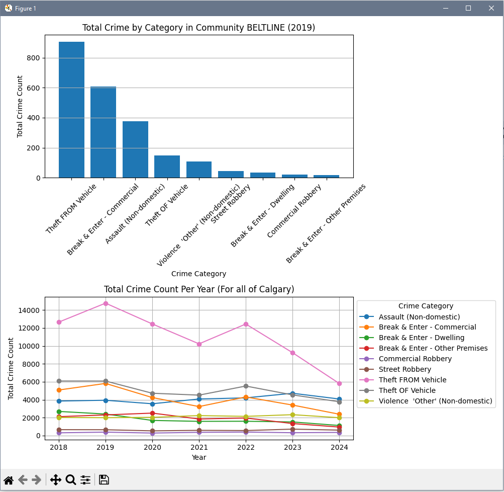

# Report

## Dataset Description

The program primarily uses the Calgary **Community Crime Statistics** Dataset [1], which provides detailed monthly crime statistics from 2018 to 2024. The dataset includes information such as crime count, crime category, year, month, and location by community. The final dataset when merged includes columns such as business count, median assessed value, sector, wards, population household; with additional columns created that include Crime per Capita 1000 or Community Crime MTD Total


## User Interface Input and Output Summary

### Input

Users interact with the program through a command-line interface (CLI) where they are prompted to:

1. Choose whether to view reference maps (sector, ward, community).
2. Select the type of region: Sector, Ward, or Community.
3. Specify the exact name of the Sector, Ward, or Community.
4. Specify the year.

The user must enter a Sector, Ward, Community, and year that exists in the dataset. If there is an invalid input, the user is prompted for re-entry without terminating the program. The program is also designed to handle case-sensitive inputs or extra spaces.

### Output

The program returns data visualizations and statistics tailored to the selected region and year, including:

- A text summary of basic descriptive statistics for the chosen region and year.
- A plot showing **crime count by category**. (A general plot across all years in Calgary is shown for comparison)
- A bar chart of **monthly crime counts**. (A general plot across all years in Calgary is shown for comparison)
- A scatter plot comparing **crime per capita vs median assessed value**.
- A scatter plot comparing **total crime count vs number of businesses**.

The user is also prompted whether to analyze another region or quit. Upon quitting, the program thanks the user.

## Specification Compliance

### Data Handling
More than 3 seperate datasets are merged into a large dataset. All data is pulled directly from the .csv file without modification. The crime dataset is merged with:
- The *Communities by Wards* dataset [2] to retrieve the wards and sector column in the dataset
- The *Calgary Business Licences* [3] dataset to retrieve a count of the number of businesses in a community
- The *Assessments by Community* [4] dataset to retrieve the median assessed value of a community
- and The 2016, 2017, 2019, and 2021 *Census by Community* and *Federal Census Population by Community* datasets [5],[6],[7],[8] are merged and extrapolated to get the population of each community for a specified year.


### Code Implementation
The program meets this requirement because:
1. A print_describe() function uses the describe() method to give statistics (count, mean, min, max, std. deviation, etc.) about the crime count, Crime per Capita 1000, Businesses Opened, and Median Assess Value
2. We added two or more columns to the main dataframe. We calculated the Crime per Capita (per 1000 residents) and summed the Business count for the community.
3. A masking operation, groupby operation, pivot table, and aggregation computation was used for a subset of the data when creating plots. For example: A masking operation is used based on the location and year, a group by operation and aggregation computation was used to get the total crime count for each month.

```python
    subset = final_df[(final_df[location_type] == location) & (final_df['Year'] == year)]
    monthly_crime = subset.groupby('Month')['Crime Count'].sum().reset_index()
```
A Pivot table was also created to easily plot the total crime count per month for each year
```python
    crime_month = final_df.groupby(['Year', 'Month'])['Crime Count'].sum().reset_index()
    pivot_table = crime_month.pivot(index='Month', columns='Year', values='Crime Count')
```
### User Interface and Execution
The program meets this requirement because the user enters two required input values. The region and the year. Invalid inputs are handled and prompted for re-entry. Screenshots are provided for the expected execution, including handling of incorrect input:


Plots are show that depicts an aspect of the data. Screenshots of plots can be found in /screenshots. There are a total of four Plots, one example shown below:



### Commenting and Syntax
The program includes comments throughout the code for clarity. Classes, methods, and functions are documented using docstrings.  variables and functions are lowercase and seperated by underscore (e.g. get_location(), get_year()), all classes have camelCase names (e.g. dataLoader, dataVisualizer, userInputs.).


## Citation:  

[1] The City of Calgary. Community Crime Statistics [Data set]. Calgary Open Data Portal. 2025.
Available: https://data.calgary.ca/Health-and-Safety/Community-Crime-Statistics/78gh-n26t/about_data

[2] The City of Calgary. Communities by Ward [Data set]. Calgary Open Data Portal. 2025.
Available: https://data.calgary.ca/Government/Communities-by-Ward/jd78-wxjp/about_data

[3] The City of Calgary. Calgary Business Licences [Data set]. Calgary Open Data Portal. 2025.
Available: https://data.calgary.ca/Business-and-Economic-Activity/Calgary-Business-Licences/vdjc-pybd/about_data

[4] The City of Calgary. Assessments by Community [Data set]. Calgary Open Data Portal. 2025.
Available: https://data.calgary.ca/Government/Assessments-by-Community/p84b-7zbi/about_data

[5] The City of Calgary. Census by Community 2016 [Data set]. Calgary Open Data Portal. 2025.
Available: https://data.calgary.ca/Demographics/Census-by-Community-2016/hfwb-eab8/about_data

[6] The City of Calgary. Census by Community 2017 [Data set]. Calgary Open Data Portal. 2025.
Available: https://data.calgary.ca/Demographics/Census-by-Community-2017/d8k6-ide9/about_data

[7] The City of Calgary. Census by Community 2019 [Data set]. Calgary Open Data Portal. 2025.
Available: https://data.calgary.ca/browse?q=Census+by+Community+2019&sortBy=relevance&pageSize=20

[8] The City of Calgary. 2021 Federal Census Population and Dwellings by Community [Data set]. Calgary Open Data Portal. 2025.
Available: https://data.calgary.ca/Demographics/2021-Federal-Census-Population-and-Dwellings-by-Co/f9wk-wej9/about_data 


